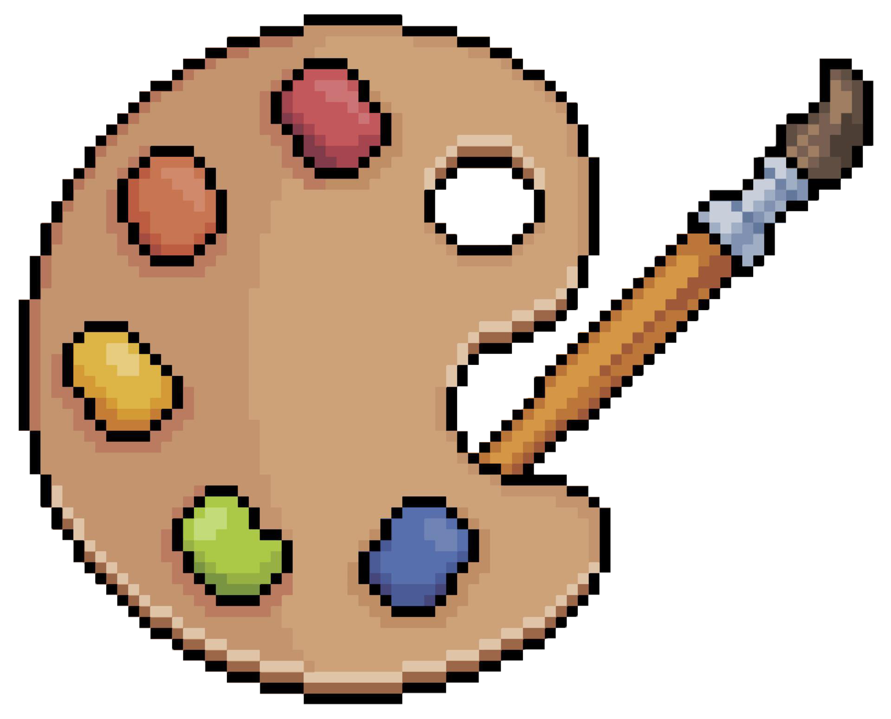

  

<h1 align="center">
  SpriteLab
</h1>

  A Free, Open Sourced, and Lightweight Sprite Editor Written In C++ Using SDL

  
  
    

## Features

* Modern design.
* Clean UI.
* Free and open sourced.
* Fast and lightweight.
* Multiple layers.
* Multiple projects opened at once.
* Export to a variety of image formats.
* Optimized for performance.
* And so much more!

## Todo

- ✅ Export to Variety of File Formats
- ✅ Ability to Save and Load Projects
- ✅ Multiple Projects Opened At Once
- ✅ Layers
- ✅ Important Editing Tools like Brush, Eraser, Fill, Color Picker, etc
- ⬜ Support To Import Projects From Other Sprite Editors
- ⬜ Fix Window Scaling
- ⬜ Optimize Exports
- ⬜ Export to Sprite Sheet
- ⬜ Add All Editing Tools
- ⬜ Undo and Redo Functionality
- ⬜ Organize Project
- ⬜ Modern UI
- ⬜ Release v1

## Contributing

Contributions are welcome! If you have any suggestions, bug reports, or feature requests, feel free to open an issue or submit a pull request.
https://img.shields.io/github/contributors/ElectroGamesDev/SpriteLab

## License

This project is licensed under the [GNU General Public License v3.0](LICENSE).
